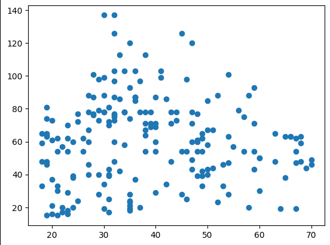
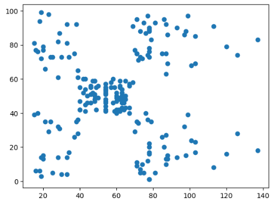
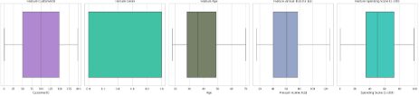
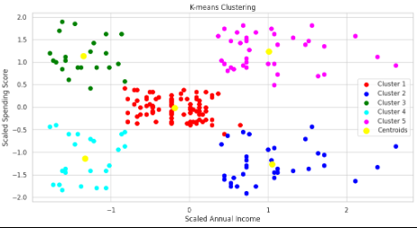

# Laporan Proyek Machine Learning
### Nama : Arya Surya Prasetya
### Nim : 211351030
### Kelas : Pagi A

## Domain Proyek
Proyek ini bertujuan untuk memahami perilaku konsumen dengan menerapkan teknik segmentasi pelanggan. Dengan menggunakan algoritma K-Means, kita akan mengelompokkan pelanggan mall berdasarkan fitur-fitur tertentu, seperti usia, Jenis Kelamin, Pendapatan Tahunan dan skor pengeluaran.

## Business Understanding
Tujuan utama dari proyek ini adalah untuk memahami perilaku konsumen dan mengidentifikasi segmen pelanggan yang berbeda di mall. Dengan memahami segmen ini, manajemen mall dapat merancang strategi pemasaran yang lebih efektif dan personal, yang pada akhirnya dapat meningkatkan penjualan dan kepuasan pelanggan.

Bagian laporan ini mencakup:

### Problem Statements
- Bagaimana kita dapat mengidentifikasi segmen pelanggan yang berbeda di mall kami?
- Apa karakteristik unik dari setiap segmen pelanggan ini?
- Bagaimana kita dapat merancang strategi pemasaran yang efektif untuk setiap segmen ini?
- Bagaimana pemahaman tentang segmen pelanggan dapat digunakan untuk meningkatkan penjualan dan kepuasan pelanggan?


### Goals
- Tujuan utama dari proyek ini adalah untuk mengidentifikasi segmen pelanggan yang berbeda di mall. 
- Selain mengidentifikasi segmen pelanggan, tujuan lainnya adalah memahami karakteristik unik dari setiap segmen
- Setelah memahami karakteristik setiap segmen, tujuan selanjutnya adalah merancang strategi pemasaran yang sesuai untuk setiap segmen.
- Tujuan akhir dari proyek ini adalah untuk meningkatkan penjualan dan kepuasan pelanggan.


### Solution statements
- Solusi utama adalah menerapkan algoritma K-Means untuk mengelompokkan pelanggan mall ke dalam segmen yang berbeda.
- Setelah segmentasi dilakukan, solusi berikutnya adalah menganalisis karakteristik unik dari setiap segmen pelanggan. 
- Setelah segmentasi dilakukan, solusi berikutnya adalah menganalisis karakteristik unik dari setiap segmen pelanggan. 
-  Solusi akhir adalah meningkatkan penjualan dan kepuasan pelanggan dengan menerapkan strategi pemasaran yang sesuai untuk setiap segmen.

## Data Understanding
| Nomer | Variabel           | Tipe Data | Keterangan                           |
| ----- | ------------------ | :-------: | ------------------------------------ |
| 1     | CustomerID              |  int64 | Berisi Nama nama pelanggan           |
| 2     | Genre             | object| Berisi umur pelanggan                |
| 3     | Age              |  int64   | Berisi jenis kelamin pelanggan       |
| 4     | Annual Income        |  int64   | Berisi Tingkat pendidikan pelanggan  |
| 5     | Spending Score          |  int64  | Berisi pendapatan pelanggan          |






 
## Data Preparation
### Data Collection
Untuk dataset ini saya mengambil dari kaggle.
Dataset yang digunakan: [Mall Customer](https://www.kaggle.com/datasets/shwetabh123/mall-customers).

### Data Discovery And Profiling
```bash
import streamlit as st
import numpy as np
import matplotlib.pyplot as plt
import seaborn as sns
```

```bash
from google.colab import files
files.upload()
```

```bash
!mkdir -p ~/.kaggle
!cp kaggle.json ~/.kaggle/
!chmod 600 ~/.kaggle/kaggle.json
!ls ~/.kaggle
```

```bash
!unzip mall-customers.zip -d mall
!ls mall
```

```bash
Archive:  mall-customers.zip
  inflating: mall/Mall_Customers.csv  
Mall_Customers.csv      
cereal.csv
```

```bash
df = pd.read_csv('/content/mall/Mall_Customers.csv')
df.head(10)
```
```bash
X = df.iloc[:,:-1].values
y = df.iloc[:,-1].values
```
```bash
df.head().style.background_gradient(cmap =sns.cubehelix_palette(as_cmap=True))
```
```bash
df.info()
```
```bash
df.describe()
```
```bash
plt.figure(figsize=(10,8))
sns.heatmap(df.corr(),annot=True)
```
``` bash
df.describe()
```
```bash
df.sample()
```
``` bash
plt.scatter(df['Age'],df['Annual Income (k$)'])
plt.figure(figsize=(12,6))
```
```bash
fig, axes = plt.subplots(nrows=1, ncols=len(df.columns), figsize=(25, 6))
axes = axes.flatten()
sns.set(style='whitegrid')
for i, feature in enumerate(df.columns):
    if pd.api.types.is_numeric_dtype(df[feature]):
        x_data = df[feature]
    else:
        x_data = pd.factorize(df[feature])[0]

    sns.boxplot(x=x_data, ax=axes[i], color=np.random.rand(3,))
    axes[i].set_title(f'Feature {feature}')

plt.tight_layout()
plt.show()
```
```bash
wcss = []
for i in range(1, 11):
    kmeans = KMeans(n_clusters = i, init = 'k-means++',n_init=100)
    kmeans.fit(X)
    print('Cost_Function=',kmeans.inertia_,'with', i, 'Clusters')
    wcss.append(kmeans.inertia_)

plt.plot(range(1, 11), wcss)
plt.title('The Elbow Method')
plt.xlabel('Number of clusters')
plt.ylabel('WCSS')
plt.show()
```
```bash
fig, axes = plt.subplots(nrows=1, ncols=len(df.columns), figsize=(25, 6))
axes = axes.flatten()
sns.set(style='whitegrid')
for i, feature in enumerate(df.columns):
    if pd.api.types.is_numeric_dtype(df[feature]):
        x_data = df[feature]
    else:
        x_data = pd.factorize(df[feature])[0]

    sns.boxplot(x=x_data, ax=axes[i], color=np.random.rand(3,))
    axes[i].set_title(f'Feature {feature}')

plt.tight_layout()
plt.show()
```
```bash
numeric_columns = ['Age', 'Annual Income (k$)', 'Spending Score (1-100)']
```
```bash
Q1 = df[numeric_columns].quantile(0.25)
Q3 = df[numeric_columns].quantile(0.75)
IQR = Q3 - Q1
```

```bash
lower_bound = Q1 - 1.5 * IQR
upper_bound = Q3 + 1.5 * IQR
```

``` bash
outliers = ((df[numeric_columns] < lower_bound) | (df[numeric_columns] > upper_bound)).any(axis=1)
```
```bash
df = df[~outliers]
```
``` bash
X = df.iloc[:, 3:].values
print(X)
```
```bash
scaler = StandardScaler()
X = scaler.fit_transform(X)
``` bash
sse = []
for i in range(1,9):
    kmeans = KMeans(n_clusters=i , max_iter=300)
    kmeans.fit(X)
    sse.append(kmeans.inertia_)

fig = px.line(y=sse,template="seaborn",title='Eblow Method')
fig.update_layout(width=800, height=600,
title_font_color="#BF40BF",
xaxis=dict(color="#BF40BF",title="Clusters"),
yaxis=dict(color="#BF40BF",title="SSE"))
```